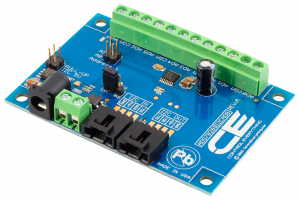

# ADS7828

This library provides a class for the ADS7828, it relies on the ncd-red-comm library for communication, and includes a node-red node for the ADS7828. The ADS7828 is an 8-channel, 12-bit, I2C compatible, analog-to-digital converter. [Ncd.io](https://ncd.io) manufactures a full breakout board that utilizes this chip, you can find it [here](https://store.ncd.io/product/ads7828-analog-to-digital-converter-8-channel-12-bit-with-i2c-interface/).

[](https://store.ncd.io/product/ads7828-analog-to-digital-converter-8-channel-12-bit-with-i2c-interface/)

### Installation

This library can be installed with npm with the following command:

```
npm install ncd-red-ads7828
```

For use in node-red, use the same command, but inside of your node-red directory (usually `~./node-red`).

### Usage

The `test.js` file included in this library contains basic examples for use. The [datasheet](http://www.ti.com/lit/ds/symlink/ads1115.pdf) contains more information on specific settings. All of the available configurations are available in the node-red node through the UI.

### Raspberry Pi Notes

If you intend to use this on the Raspberry Pi, you must ensure that:
1. I2C is enabled (there are plenty of tutorials on this that differ based on the Pi version.)
2. Node, NPM, and Node-red should be updated to the LTS versions. If you skip this step the ncd-red-comm dependency may not load properly.
